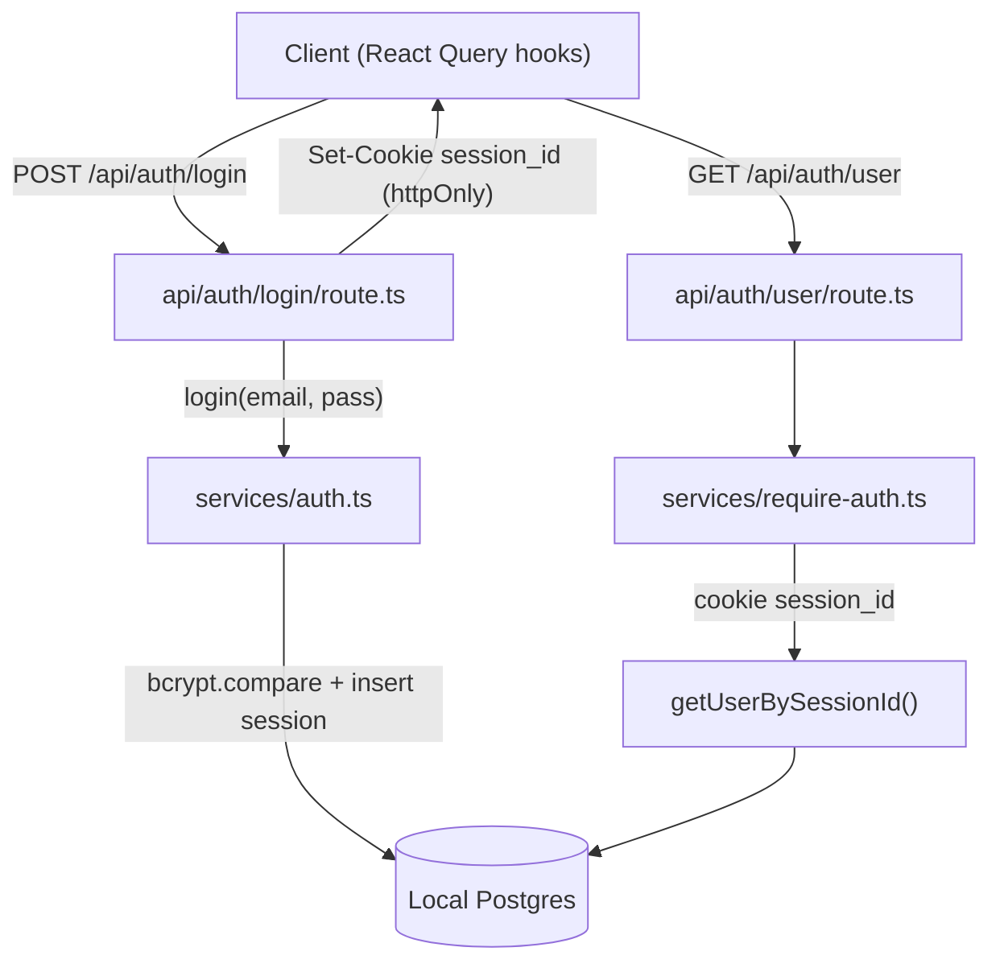
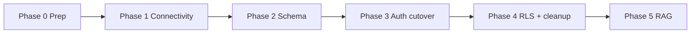
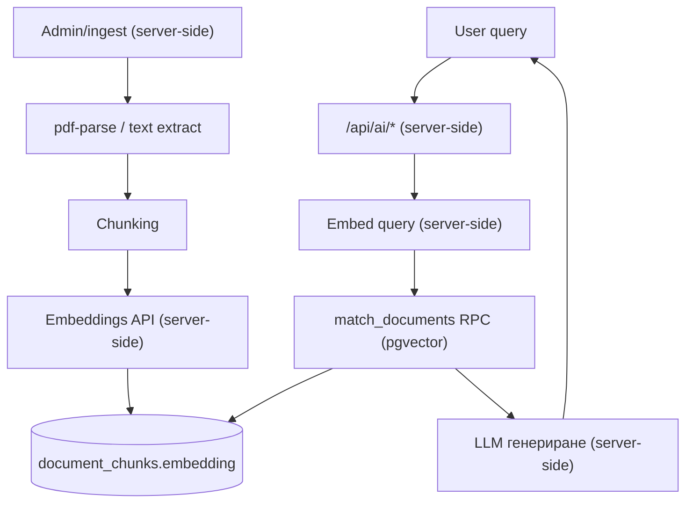

# План за миграция към Supabase

> Документ само за планиране. Тук няма изпълнение на миграция, промени по код, схема, `.env` или база данни. Целта е пълен, изпълним план за преход от текущата архитектура (custom auth + локален PostgreSQL) към Supabase (Auth, PostgreSQL, Drizzle ORM, бъдещ RAG с pgvector), като AI endpoints остават server-side.

Дата на анализа: 2026-07-13
Изготвил: senior Next.js / Drizzle / PostgreSQL / Supabase архитект (анализ)

---

## Съдържание

1. [Резюме на текущата архитектура](#1-резюме-на-текущата-архитектура)
2. [Засегнати файлове](#2-засегнати-файлове)
3. [Засегнати таблици](#3-засегнати-таблици)
4. [Рискове](#4-рискове)
5. [План по фази](#5-план-по-фази)
6. [Конкретни промени по Drizzle schema](#6-конкретни-промени-по-drizzle-schema)
7. [Нужните SQL migrations](#7-нужните-sql-migrations)
8. [RLS policies](#8-rls-policies)
9. [Authentication migration plan](#9-authentication-migration-plan)
10. [Future RAG plan с pgvector](#10-future-rag-plan-с-pgvector)
11. [Testing checklist](#11-testing-checklist)
12. [Rollback plan](#12-rollback-plan)
13. [Финална препоръка](#13-финална-препоръка)

---

## 1. Резюме на текущата архитектура

### 1.1 Технологичен стек

- **Framework:** Next.js `16.2.1` (App Router), React `19.2.4`.
- **ORM:** Drizzle ORM `0.45.1` + `drizzle-kit 0.31.10`.
- **Драйвер:** `postgres` (`postgres-js`), пул с `max: 10`.
- **База данни:** **локален** PostgreSQL — `postgresql://app@localhost:5432/traineat` (от `.env`, ключ `DATABASE_URL`).
- **Auth:** напълно **собствена (custom)** реализация — `bcrypt` за хеширане, собствена таблица `sessions` със `session_id` httpOnly cookie, таблица `reset_token` за забравена парола, ръчно заключване след неуспешни опити.
- **Валидация:** `zod 4`.
- **State/data fetching (клиент):** `@tanstack/react-query 5`.
- **UI:** Tailwind 4 + Radix / shadcn компоненти.
- **Vector:** таблицата `document_chunks` вече дефинира `vector({ dimensions: 1536 })`, т.е. pgvector е предвиден, но екстеншънът/индексът все още не са настроени.

### 1.2 Auth поток (текущ)



Ключови детайли:

- Логин/регистрация задават cookie `session_id` (httpOnly, `sameSite: lax`, `secure` в production), срок 1 час (`SESSION_MS`).
- `requireAuth()` в [src/server/services/require-auth.ts](src/server/services/require-auth.ts) чете `session_id` от cookie и извиква `getUserBySessionId()`.
- Заключване на акаунт след `MAX_FAILED_ATTEMPTS = 3` за 1 час (`LOCKOUT_MS`).
- Няма `middleware.ts`, няма refresh на сесия, няма Supabase библиотеки.
- Няма реални AI endpoints все още (`documents` / `document_chunks` са подготовка за RAG).
- Няма папка с генерирани Drizzle миграции (няма baseline история).

### 1.3 Схема (текуща)

- `users` — `id integer generatedAlwaysAsIdentity` (PK), `name`, `email unique`, `password` (bcrypt hash), `created_at`, `failed_login_attempts`, `locked_until`.
- `user_profiles` — PK/FK `user_id integer` -> `users.id` (`onDelete: cascade`); физически данни, цели, тип тренировки (`jsonb`), диета, бележки.
- `sessions` — `id text` (UUID), `user_id integer` FK, `expires_at`, `created_at`.
- `reset_token` — `id text`, `user_id integer` FK, `token_hash`, срокове.
- `documents` — `id serial`, `title`, `category`, `topic`, `source`, `language` (default `bg`), `created_at`.
- `document_chunks` — `id serial`, `document_id integer` FK, `chunk_index`, `conntent` (правописна грешка), `embeddinng vector(1536)` (правописна грешка).

---

## 2. Засегнати файлове

### 2.1 Конфигурация и връзка

- [ ] [.env](.env) — добавяне на Supabase променливи; смяна на `DATABASE_URL` към Supabase pooler.
- [ ] [src/env.d.ts](src/env.d.ts) — типизиране на новите env променливи.
- [ ] [drizzle.config.ts](drizzle.config.ts) — `schemaFilter`, за да не управлява Drizzle схемата `auth` на Supabase; насочване към Supabase (direct/session connection за миграции).
- [ ] [src/server/db/client.ts](src/server/db/client.ts) — връзка към Supabase (pooler), опционално `prepare: false` при transaction pooler.

### 2.2 Drizzle схеми

- [ ] [src/server/db/schema/users.ts](src/server/db/schema/users.ts) — премахване на custom `users` таблица; въвеждане на `profiles` (или преназначаване на `user_profiles`) с `uuid` PK -> `auth.users.id`.
- [ ] [src/server/db/schema/auth.ts](src/server/db/schema/auth.ts) — премахване на `sessions` и `reset_token` (Supabase поема сесии и reset).
- [ ] [src/server/db/schema/user_profiles.ts](src/server/db/schema/user_profiles.ts) — `user_id integer` -> `uuid`, FK към `auth.users`.
- [ ] [src/server/db/schema/documents.ts](src/server/db/schema/documents.ts) — по избор `owner_id uuid` за RLS; иначе без промяна.
- [ ] [src/server/db/schema/documents_chunks.ts](src/server/db/schema/documents_chunks.ts) — fix `conntent` -> `content`, `embeddinng` -> `embedding`; добавяне на векторен индекс.
- [ ] [src/server/db/schema/index.ts](src/server/db/schema/index.ts) — актуализиране на re-exports след премахване на таблици.

### 2.3 Server услуги

- [ ] [src/server/services/auth.ts](src/server/services/auth.ts) — премахване на bcrypt/session логиката; делегиране към Supabase Auth (admin API за server-side операции).
- [ ] [src/server/services/require-auth.ts](src/server/services/require-auth.ts) — вместо cookie `session_id`, използване на Supabase server client + `auth.getUser()`.
- [ ] [src/server/services/users.ts](src/server/services/users.ts) — `createUser`/`updateUserPassword`/`deleteUser` -> Supabase Admin API; типове `id number` -> `string (uuid)`.
- [ ] [src/server/services/users_profile_data.ts](src/server/services/users_profile_data.ts) — `user_id: number` -> `string`; проверките `getUserById` -> проверка срещу `auth.users`/JWT.

### 2.4 API routes

- [ ] [src/app/api/auth/login/route.ts](src/app/api/auth/login/route.ts) — `signInWithPassword` през server client.
- [ ] [src/app/api/auth/register/route.ts](src/app/api/auth/register/route.ts) — `signUp` през server client.
- [ ] [src/app/api/auth/logout/route.ts](src/app/api/auth/logout/route.ts) — `signOut`.
- [ ] [src/app/api/auth/user/route.ts](src/app/api/auth/user/route.ts) — `getUser()` + join към `profiles`.
- [ ] [src/app/api/user/onboarding/route.ts](src/app/api/user/onboarding/route.ts) — `requireAuth()` връща `uuid`; типове.

### 2.5 Клиент

- [ ] [src/lib/authFetch.ts](src/lib/authFetch.ts) — остава основно същият (401 -> redirect); опционален browser Supabase client.
- [ ] [src/hooks/user.ts](src/hooks/user.ts) — типове (`InsertUser` вече не съществува в стария вид) и евентуално директно ползване на `supabase-js`.
- [ ] [src/types/api-types.ts](src/types/api-types.ts) — синхронизиране на типове (uuid).

### 2.6 Нови файлове

- [ ] `middleware.ts` (корен) — refresh на Supabase сесия при всяка заявка (`@supabase/ssr`).
- [ ] `src/lib/supabase/server.ts` — server client (cookies-based).
- [ ] `src/lib/supabase/client.ts` — browser client.
- [ ] `src/lib/supabase/middleware.ts` — helper за session refresh в middleware.
- [ ] `src/lib/supabase/admin.ts` — service-role client (само server-side, за админ операции и AI endpoints).

### 2.7 Зависимости (package.json)

- [ ] Добавяне: `@supabase/supabase-js`, `@supabase/ssr`.
- [ ] Премахване (в края): `bcrypt`, `@types/bcrypt` (след като custom auth отпадне).
- [ ] За RAG (по-късно): SDK за embeddings (напр. `openai` или `ai`), `pdf-parse` вече е наличен.

---

## 3. Засегнати таблици

| Таблица | Действие | Забележка |
|---|---|---|
| `users` | **Премахва се / заменя се** | Идентичността минава към `auth.users`; профилни полета -> `profiles`. |
| `sessions` | **Премахва се** | Supabase управлява сесии (JWT + refresh cookies). |
| `reset_token` | **Премахва се** | Supabase управлява reset/recovery. |
| `user_profiles` | **Мигрира** | `user_id integer` -> `uuid` FK към `auth.users`; преименуване към `profiles` (по избор). |
| `documents` | **Малка промяна + RLS** | По избор `owner_id uuid`; включване на RLS. |
| `document_chunks` | **Промяна + индекс + RLS** | Fix `conntent`/`embeddinng`; pgvector индекс; RLS. |

Checklist:

- [ ] Потвърдено: няма продукционни данни, които изискват сложна data-миграция (dashboard е празен, липсва migrations история).
- [ ] Решено: `user_profiles` се преименува на `profiles` (по избор, но препоръчително).
- [ ] Решено дали `documents` са глобални (админ качва) или per-user (влияе на RLS).

---

## 4. Рискове

- [ ] **`integer id` -> `uuid`**: най-голямата структурна промяна. Всички FK към `users.id` са `integer`. Без реални данни -> clean cutover; с данни -> нужна е map таблица (стар `int` -> нов `uuid`).
- [ ] **FK каскади**: `user_profiles`, `sessions`, `reset_token` използват `onDelete: cascade`. При преминаване към `auth.users` FK каскадите трябва да сочат към `auth.users(id)`.
- [ ] **Drizzle vs Supabase системни схеми**: `drizzle-kit push`/`generate` НЕ трябва да управлява/трие схемата `auth`, `storage`, `extensions`. Задължителен `schemaFilter: ["public"]`.
- [ ] **RLS vs server connection**: Drizzle се свързва през Postgres роля. Ако използва `service_role`/direct connection, **RLS се байпасва**. Трябва съзнателно решение: server-side заявки минават с елевирани права, а RLS е защита за клиентски (anon) достъп и defense-in-depth.
- [ ] **pgvector extension**: трябва да се активира (`create extension vector`) преди `document_chunks` да работи; измерение `1536` трябва да съвпада с избрания embedding модел.
- [ ] **Липса на baseline миграции**: няма `drizzle` папка с история -> нужен е чист baseline срещу Supabase, за да не се получат разминавания.
- [ ] **Connection pooling**: transaction pooler (порт 6543) изисква `prepare: false` за `postgres-js`; за миграции се ползва session pooler / direct (порт 5432).
- [ ] **Загуба на кастъм логика**: заключване след 3 опита (`failed_login_attempts`, `locked_until`) не е 1:1 в Supabase — трябва алтернатива (Supabase rate limiting / Attack Protection или Edge middleware).
- [ ] **Смяна на типа на паролите**: bcrypt хешовете не се пренасят директно; при съществуващи потребители е нужен import с bcrypt hashes през Admin API или reset flow.
- [ ] **Разходи/латентност за embeddings**: генерирането на embeddings за кирилски текст има API разходи и трябва да е server-side.
- [ ] **Времеви зони / `created_at`**: `auth.users` носи собствени timestamps; профилът трябва да разчита на тях, за да няма дублиране.

---

## 5. План по фази

### Фаза 0 — Подготовка

- [x] Създаване на Supabase проект (регион близо до потребителите).
- [X] Записване на: `Project URL`, `anon key`, `service_role key`, connection strings (direct/session/transaction pooler).
- [ ] Създаване на Git branch `feature/supabase-migration`.
- [ ] Пълен backup/snapshot на текущата локална база (`pg_dump`).
- [x] Инсталиране на `@supabase/supabase-js` и `@supabase/ssr`.

### Фаза 1 — Свързаност и baseline

- [x] Добавяне на env променливи (Раздел 9.1).
- [x] Настройка на `drizzle.config.ts` със `schemaFilter: ["public"]` и Supabase connection.
- [x] Активиране на `vector` extension в Supabase.
- [ ] Генериране на baseline Drizzle миграция срещу празна `public` схема.

### Фаза 2 — Схема

- [ ] Прилагане на новите Drizzle схеми (Раздел 6).
- [ ] Прилагане на SQL миграции за `auth.users` FK, `handle_new_user` trigger, индекси (Раздел 7).

### Фаза 3 — Authentication cutover

- [ ] Създаване на Supabase clients (`server.ts`, `client.ts`, `middleware.ts`, `admin.ts`).
- [ ] Добавяне на `middleware.ts` за session refresh.
- [ ] Пренаписване на `require-auth.ts` към `auth.getUser()`.
- [ ] Пренаписване на auth route-овете (`login`, `register`, `logout`, `user`).
- [ ] Актуализиране на `users.ts` / `users_profile_data.ts` към `uuid`.
- [ ] Актуализиране на клиентските hooks и типове.

### Фаза 4 — RLS и почистване

- [ ] Включване на RLS + политики (Раздел 8).
- [ ] Премахване на `sessions`, `reset_token`, custom `users` таблица и `bcrypt`.
- [ ] End-to-end тестове (Раздел 11).

### Фаза 5 — RAG слой (бъдещ)

- [ ] Ingestion pipeline (chunking + embeddings), server-side.
- [ ] `match_documents` RPC + векторен индекс.
- [ ] Server-side AI endpoint(и) за retrieval + генериране.



---

## 6. Конкретни промени по Drizzle schema

> Забележка: Drizzle не създава `auth.users` (това е Supabase системна таблица). Референцията се прави чрез `pgSchema("auth")` само за FK, а `drizzle-kit` се ограничава до `public` чрез `schemaFilter`.

### 6.1 Референция към `auth.users` (нов helper)

```ts
// src/server/db/schema/supabase-auth.ts
import { pgSchema, uuid } from "drizzle-orm/pg-core";

// Само за FK референция; тази схема се управлява от Supabase.
export const authSchema = pgSchema("auth");
export const authUsers = authSchema.table("users", {
  id: uuid("id").primaryKey(),
});
```

### 6.2 `profiles` (замяна на `users` + `user_profiles`)

```ts
// src/server/db/schema/profiles.ts
import {
  pgTable, uuid, integer, text, timestamp, jsonb,
  pgEnum,
} from "drizzle-orm/pg-core";
import { authUsers } from "./supabase-auth";

// ... enums (experience_level, activity_level, sex, diet_type) остават същите ...

export const profilesTable = pgTable("profiles", {
  id: uuid("id")
    .primaryKey()
    .references(() => authUsers.id, { onDelete: "cascade" }),
  full_name: text(),
  experience_level: experienceLevelEnum(),
  age: integer(),
  height_cm: integer(),
  weight_kg: integer(),
  sex: sexEnum(),
  activity_level: activityLevelEnum(),
  goals: jsonb().$type<Goal[]>(),
  workout_types: jsonb().$type<WorkoutType[]>(),
  weekly_training_days: integer(),
  diet_preference: dietEnum(),
  notes: text(),
  updated_at: timestamp({ withTimezone: true }).defaultNow().notNull(),
});
```

Checklist:

- [ ] `user_id integer` -> `id uuid` PK/FK към `auth.users`.
- [ ] Име, email не се дублират — идват от `auth.users` (email) и JWT metadata.
- [ ] Enums остават без промяна.

### 6.3 Премахване на `sessions` и `reset_token`

- [ ] Изтриване на съдържанието на [src/server/db/schema/auth.ts](src/server/db/schema/auth.ts) (или самия файл).
- [ ] Премахване на съответните `export *` от `index.ts`.

### 6.4 `document_chunks` (fix + индекс)

```ts
// src/server/db/schema/documents_chunks.ts
import { pgTable, serial, integer, text, vector, index } from "drizzle-orm/pg-core";
import { documentsTable } from "./documents";

export const documentChunksTable = pgTable("document_chunks", {
  id: serial().primaryKey(),
  document_id: integer().notNull()
    .references(() => documentsTable.id, { onDelete: "cascade" }),
  chunk_index: integer().notNull(),
  content: text().notNull(),                 // беше: conntent
  embedding: vector({ dimensions: 1536 }).notNull(), // беше: embeddinng
}, (t) => [
  index("document_chunks_embedding_idx")
    .using("hnsw", t.embedding.op("vector_cosine_ops")),
]);
```

Checklist:

- [ ] Fix `conntent` -> `content`.
- [ ] Fix `embeddinng` -> `embedding`.
- [ ] Добавяне на HNSW (или ivfflat) индекс с `vector_cosine_ops`.

### 6.5 `drizzle.config.ts`

```ts
export default defineConfig({
  dialect: "postgresql",
  schema: "./src/server/db/schema",
  schemaFilter: ["public"],   // не докосвай auth/storage/extensions
  dbCredentials: { url: process.env.DATABASE_URL! },
});
```

### 6.6 `src/server/db/client.ts`

```ts
const client = postgres(process.env.DATABASE_URL!, {
  max: 10,
  prepare: false, // задължително при transaction pooler (порт 6543)
});
```

---

## 7. Нужните SQL migrations

> Следните SQL блокове са референтни. Част от тях (extension, trigger) се прилагат директно в Supabase SQL editor, тъй като са извън `public`/извън обхвата на Drizzle.

### 7.1 Активиране на pgvector

```sql
create extension if not exists vector with schema extensions;
```

- [ ] Изпълнено в Supabase.

### 7.2 Автоматично създаване на профил при регистрация

```sql
create or replace function public.handle_new_user()
returns trigger
language plpgsql
security definer set search_path = public
as $$
begin
  insert into public.profiles (id, full_name)
  values (new.id, new.raw_user_meta_data->>'full_name');
  return new;
end;
$$;

drop trigger if exists on_auth_user_created on auth.users;
create trigger on_auth_user_created
  after insert on auth.users
  for each row execute function public.handle_new_user();
```

- [ ] Trigger създаден.

### 7.3 Векторен индекс (ако не е през Drizzle)

```sql
create index if not exists document_chunks_embedding_idx
  on public.document_chunks
  using hnsw (embedding vector_cosine_ops);
```

- [ ] Индекс създаден.

### 7.4 (Опционално) миграция на съществуващи потребители

- [ ] Ако има реални users: import през Admin API (`auth.admin.createUser` с `password_hash` за bcrypt) или масов reset flow.
- [ ] Map таблица `legacy_user_map(old_int_id, new_uuid)` за пренасяне на `user_profiles`.

---

## 8. RLS policies

> RLS се прилага на таблиците в `public`. Server-side заявки през `service_role`/direct connection **байпасват** RLS — затова чувствителните операции остават server-side, а RLS пази клиентския (anon/authenticated) достъп.

### 8.1 `profiles`

```sql
alter table public.profiles enable row level security;

create policy "Profiles are viewable by owner"
  on public.profiles for select
  using (auth.uid() = id);

create policy "Users can insert own profile"
  on public.profiles for insert
  with check (auth.uid() = id);

create policy "Users can update own profile"
  on public.profiles for update
  using (auth.uid() = id)
  with check (auth.uid() = id);
```

- [ ] RLS включен за `profiles`.
- [ ] SELECT/INSERT/UPDATE политики.

### 8.2 `documents` (вариант A — глобални/read-only за всички логнати)

```sql
alter table public.documents enable row level security;

create policy "Documents readable by authenticated"
  on public.documents for select
  to authenticated
  using (true);
-- write операциите остават само за service_role (админ ingestion)
```

### 8.3 `document_chunks`

```sql
alter table public.document_chunks enable row level security;

create policy "Chunks readable by authenticated"
  on public.document_chunks for select
  to authenticated
  using (true);
```

- [ ] RLS включен за `documents` и `document_chunks`.
- [ ] Решен модел на достъп (глобални vs per-user `owner_id`).
- [ ] Записът на chunks/embeddings се извършва само server-side (service role).

---

## 9. Authentication migration plan

### 9.1 Environment променливи

```dotenv
# .env
NEXT_PUBLIC_SUPABASE_URL=https://<project-ref>.supabase.co
NEXT_PUBLIC_SUPABASE_ANON_KEY=<anon-key>
SUPABASE_SERVICE_ROLE_KEY=<service-role-key>   # само server-side
# Drizzle миграции (session pooler / direct):
DATABASE_URL=postgresql://postgres.<ref>:<pass>@<host>:5432/postgres
```

- [ ] `src/env.d.ts` разширен с новите ключове.
- [ ] `SUPABASE_SERVICE_ROLE_KEY` НИКОГА не се излага на клиента (без `NEXT_PUBLIC_`).

### 9.2 Supabase clients

- [ ] `src/lib/supabase/server.ts` — `createServerClient` от `@supabase/ssr` с `cookies()` от `next/headers`.
- [ ] `src/lib/supabase/client.ts` — `createBrowserClient`.
- [ ] `src/lib/supabase/middleware.ts` — helper за refresh на сесия.
- [ ] `src/lib/supabase/admin.ts` — `createClient` със service role (за Admin API и AI endpoints).

### 9.3 Middleware (session refresh)

- [ ] Нов `middleware.ts` в корена, който при всяка заявка обновява сесията и пренаписва cookies (по документацията на `@supabase/ssr`).
- [ ] `matcher`, който изключва статични файлове.

### 9.4 Пренаписване на route-овете

- [ ] `login`: `supabase.auth.signInWithPassword({ email, password })`; премахване на ръчното задаване на `session_id` cookie.
- [ ] `register`: `supabase.auth.signUp({ email, password, options: { data: { full_name } } })`; профилът се създава от trigger-а.
- [ ] `logout`: `supabase.auth.signOut()`.
- [ ] `user`: `supabase.auth.getUser()` + `select` от `profiles`.

### 9.5 `require-auth.ts`

```ts
import { createClient } from "@/lib/supabase/server";

export async function requireAuth() {
  const supabase = await createClient();
  const { data: { user } } = await supabase.auth.getUser();
  if (!user) throw new Error("UNAUTHORIZED");
  return user; // user.id е uuid
}
```

- [ ] `getUserBySessionId` премахнат/заменен.
- [ ] `user.id` вече е `string (uuid)` — обновени всички консуматори (`onboarding`, `users_profile_data`).

### 9.6 Еквивалент на custom логиката

- [ ] Заключване след неуспешни опити: заменя се със Supabase Auth rate limiting / Attack Protection (или собствен throttle в middleware).
- [ ] Password reset: `supabase.auth.resetPasswordForEmail(...)` вместо `reset_token` таблицата.
- [ ] Email потвърждение: конфигурира се в Supabase Auth настройките.

---

## 10. Future RAG plan с pgvector

### 10.1 Архитектура



### 10.2 Ключови стъпки

- [ ] Ingestion service (server-only): извличане на текст (`pdf-parse` вече наличен), chunking, генериране на embeddings, запис през service-role client.
- [ ] Единност на измерението (`1536`) с избрания embedding модел; при друг модел -> промяна на `vector({ dimensions })` и повторно генериране.
- [ ] `match_documents` RPC функция:

```sql
create or replace function public.match_documents(
  query_embedding vector(1536),
  match_count int default 5
)
returns table (id int, document_id int, content text, similarity float)
language sql stable
as $$
  select dc.id, dc.document_id, dc.content,
         1 - (dc.embedding <=> query_embedding) as similarity
  from public.document_chunks dc
  order by dc.embedding <=> query_embedding
  limit match_count;
$$;
```

- [ ] Векторен индекс (HNSW `vector_cosine_ops`) — виж Раздел 7.3.
- [ ] **AI endpoints остават server-side**: нов route(и) под `src/app/api/ai/...`, които ползват service-role client и embedding/LLM ключове само на сървъра.
- [ ] Rate limiting и логване на AI заявки.

---

## 11. Testing checklist

### 11.1 Свързаност и схема

- [ ] Drizzle миграциите се прилагат чисто срещу Supabase (`public` схема).
- [ ] `vector` extension е активен; `document_chunks` приема insert с embedding.
- [ ] `schemaFilter` предпазва `auth`/`storage` от Drizzle.

### 11.2 Authentication

- [ ] Регистрация създава `auth.users` + автоматично `profiles` ред (trigger).
- [ ] Логин задава Supabase cookies; `GET /api/auth/user` връща потребител + профил.
- [ ] Logout изчиства сесията; защитените endpoints връщат 401.
- [ ] Session refresh през middleware работи (без неочаквано разлогване).
- [ ] Onboarding `PATCH`/`POST` записва `profiles` с правилния `uuid`.

### 11.3 RLS

- [ ] Потребител A не вижда/променя профила на потребител B (през anon/authenticated client).
- [ ] Server-side (service role) операциите работят според очакванията.

### 11.4 RAG (при внедряване)

- [ ] Embeddings се записват само server-side.
- [ ] `match_documents` връща релевантни резултати.
- [ ] AI endpoint не изтича ключове към клиента.

---

## 12. Rollback plan

- [ ] Цялата работа е в отделен branch `feature/supabase-migration`; `main` остава работещ със стария стек.
- [ ] Пазен е `pg_dump` snapshot на локалната база отпреди миграцията.
- [ ] `.env` за стария `DATABASE_URL` (localhost) е запазен, за да може връзката да се върне.
- [ ] Feature flag / env превключвател между стария auth и Supabase по време на преходния период (по избор).
- [ ] Ако cutover се провали: revert на branch-а, връщане на стария `DATABASE_URL`, повторно деплойване на предишната версия.
- [ ] Supabase точка за възстановяване (PITR/branching), ако е наличен планът.
- [ ] Документиране на всяка приложена SQL миграция, за да е обратима (down миграции където е приложимо).

---

## 13. Финална препоръка

- [ ] Тъй като проектът е в **ранен етап** (празен dashboard, липса на migrations история, вероятно без реални потребители), препоръчвам **clean cutover** вместо сложна `int -> uuid` data-миграция. Това елиминира най-големия риск.
- [ ] Приемам **`profiles` таблица с `uuid` PK -> `auth.users`** като канонична идентичност; премахване на custom `users`, `sessions`, `reset_token` и `bcrypt`.
- [ ] Server-side Drizzle връзката минава през Supabase pooler; RLS се включва за defense-in-depth и за евентуален бъдещ клиентски (anon) достъп, но чувствителните операции остават server-side.
- [ ] pgvector се подготвя веднага (extension + fix на `document_chunks` + индекс), дори RAG слоят да се внедри в отделна по-късна фаза.
- [ ] **Всички AI endpoints остават server-side** и ползват service-role / модел ключове само на сървъра.
- [ ] Изпълнение по реда на фазите (0 -> 5), с preview branch/staging Supabase проект преди production cutover.

---

> Край на плана. Този документ описва „какво" и „защо"; изпълнението („как" в код) се извършва в отделни PR-и по фази.
